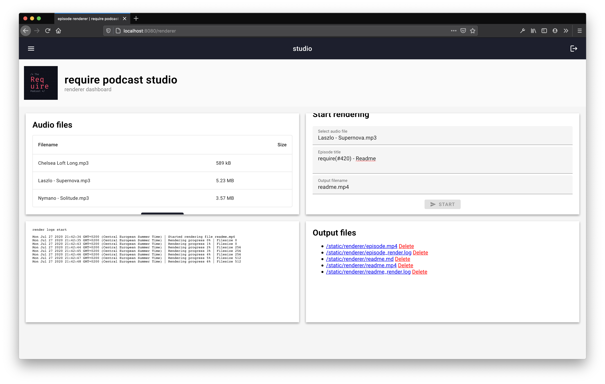
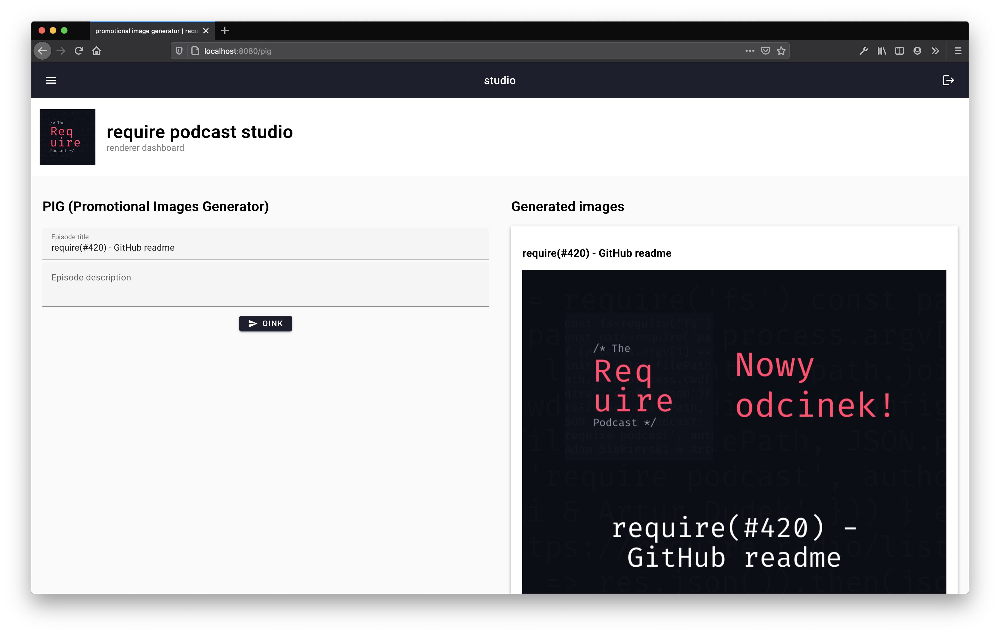

# Require Podcast's render server

After creating a podcast episode, we always need to publish it on YouTube too. Because of very long duration of videos, the render takes up to 3 hours, and completly prevents me from using my computer. That's why I decided to create a server, that will automatically generate and render our YouTube videos.

You can see the outcomes of the renderer on our [YouTube channel](https://www.youtube.com/channel/UCec_mTVjUKQAsSilMJ3J1TQ), and the images generated by PIG on our [Instagram](https://instagram.com/requirepodcast) and [Twitter](https://twitter.com/requirepodcast).

### Plans

- [x] Basic layout of background, text and logo
- [x] Create a render script, that given the audio file and title, will generate full youtube podcast episode
- [x] Create a REST API, to interact with the renderer
- [x] Create a web interface to interact with the renderer (along with socket.io, to provide render logs)
- [ ] Implement automatic YouTube publishing

### Screenshots

Renderer view:

Promotional Images Generator view:

